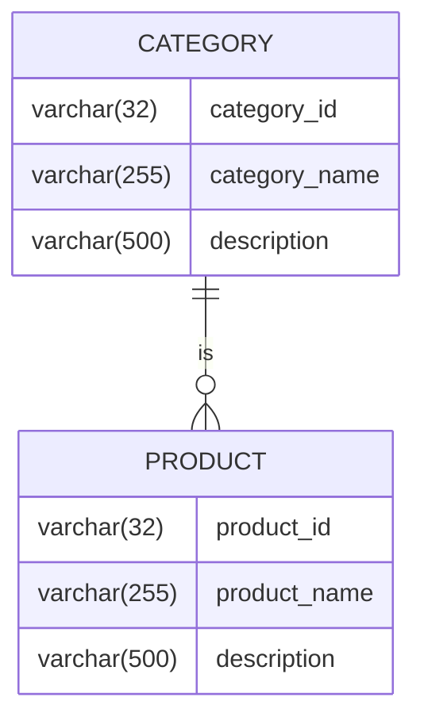

# Belajar Golang App Product Desain

## Desian database



## Api spesification

### Note

Base response

```json
{
    "code": 200,
    "status": "OK",
    "errors": [
        {
            "field": "fieldName",
            "message": "error message"
        }
    ],
    "data": {}
}
```

### Category

#### Create category

##### Create category request

- method: POST
- endpoint: `/category`
- body:

```json
{
    "categoryName": "string",
    "description": "string"
}
```

##### Create category response

```json
{
    "categoryId": "string",
    "categoryName": "string",
    "description": "string"
}
```

#### Update category

##### Update category request

- method: PUT
- endpoint: `/category/{categoryId}`
- body:

```json
{
    "categoryName": "string",
    "description": "string"
}
```

##### Update category response

```json
{
    "categoryId": "string",
    "categoryName": "string",
    "description": "string"
}
```

#### Get category

##### Get category request

- method: GET
- endpoint: `/category/{categoryId}`

##### Get category response

```json
{
    "categoryId": "string",
    "categoryName": "string",
    "description": "string"
}
```

#### Get page category

##### Get page category request

- method: GET
- endpoint: `/category`
- param:
    - `categoryName`: name of category

##### Get page category response

```json
{
    "paging": {
        "page": 0,
        "totalPage": 100,
        "itemPerPage": 10,
        "totalItem": 10
    },
    "content": [
        {
            "categoryId": "string",
            "categoryName": "string",
            "description": "string"
        }
    ]
}
```

### Product

#### Create product

##### Create product request

- method: POST
- endpoint: `/product`
- body:

```json
{
    "categoryId": "string",
    "productName": "string",
    "description": "string"
}
```

##### Create product response

```json
{
    "productId": "string",
    "categoryId": "string",
    "productName": "string",
    "description": "string"
}
```

#### Update product

##### Update product request

- method: PUT
- endpoint: `/product/{productId}`
- body:

```json
{
    "categoryId": "string",
    "productName": "string",
    "description": "string"
}
```

##### Update product response

```json
{
    "productId": "string",
    "categoryId": "string",
    "productName": "string",
    "description": "string"
}
```

#### Get product

##### Get product request

- method: GET
- endpoint: `/product/{productId}`

##### Get product response

```json
{
    "productId": "string",
    "categoryId": "string",
    "productName": "string",
    "description": "string"
}
```

#### Get page product

##### Get page product request

- method: GET
- endpoint: `/product`
- param:
    - `productName`: name of product

##### Get page product response

```json
{
    "paging": {
        "page": 0,
        "totalPage": 100,
        "itemPerPage": 10,
        "totalItem": 10
    },
    "content": [
        {
            "productId": "string",
            "categoryId": "string",
            "productName": "string",
            "description": "string"
        }
    ]
}
```